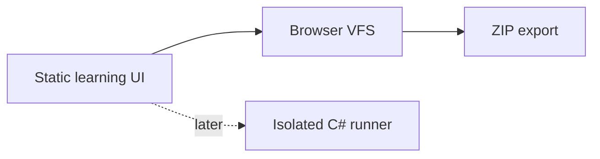

# C# (C Sharp) Playground

In-browser playground for learning **C# (C Sharp)** with a file tree, editor, lessons, and ZIP export. Phase 1 is static: code is edited in the browser and is **not** executed on this origin.

Anonymous, no login, no application server.

## Try it (GitHub Pages — validation)

After Pages is enabled: https://gymkathirza.github.io/C-sharp-playground/

```bash
npm install
npm test
npm run dev
```

Production builds use the GitHub Pages base path `/C-sharp-playground/`.



```
Lessons | Files | Editor | Console
   ▼        ▼       ▼        ▼
 local   local    edit    Phase 1 hint
```

## Hosting plan

1. **Now:** GitHub Pages for validation. Pages cannot send real CSP (Content Security Policy) headers.
2. **Next:** Harden, then Cloudflare Pages so `public/_headers` is enforced.
3. **Later:** Isolated runner (Phase 2) and a read-only learning assistant (Phase 3).

## Safety model

User C# never runs on the app origin in Phase 1. Run shows a message to export and use `dotnet run`. Max **262,144 characters** per file (derived from 1 MiB / 4 bytes), 32 files, session JSON ≤ 1.5M characters. Only `.cs`, `.csproj`, `.json`, `.txt`, `.md`. Session restore does **not** auto-run.

## Accessibility

UI follows [WAI-ARIA 1.2](https://www.w3.org/WAI/standards-guidelines/aria/) and the [ARIA Authoring Practices Guide (APG)](https://www.w3.org/WAI/ARIA/apg/patterns/): tree, tabs, dialogs, console live region, visible focus rings.

## License

MIT (Massachusetts Institute of Technology). See [LICENSE](LICENSE). Dependencies keep their own licenses.

Runtime licenses: MIT (`react-resizable-panels`, CodeMirror, JSZip MIT grant) and Apache-2.0 (none in Phase 1 runtime; TypeScript is a devDependency). No GPL (GNU General Public License) runtime.

## Glossary

| Term | Expansion | In this project |
| --- | --- | --- |
| C# | C Sharp | Language being learned |
| CSP | Content Security Policy | Browser allow-list for scripts and network |
| ARIA | Accessible Rich Internet Applications | Roles, states, and keyboard patterns |
| VFS | Virtual File System | In-browser folder tree, not a real disk |
| SDK | Software Development Kit | Pinned .NET compiler/runtime channel |
| LINQ | Language Integrated Query | Lesson on querying collections |
| APG | ARIA Authoring Practices Guide | How to implement ARIA widgets |
| MIT | Massachusetts Institute of Technology | Project license |
