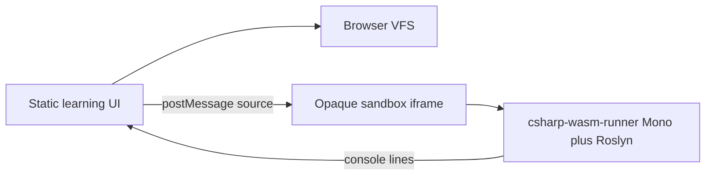

# C# (C Sharp) Playground

In-browser playground for learning **C# (C Sharp)** with a file tree, editor, lessons, ZIP export, and a sandboxed console runner.

Anonymous, no login, no application server.

## Try it (GitHub Pages — validation)

https://gymkathirza.github.io/C-sharp-playground/

```bash
npm install
npm test
npm run dev
```

Production builds use the GitHub Pages base path `/C-sharp-playground/`.



```
Lessons | Files | Editor + completions | Console
   ▼        ▼            ▼                 ▼
 local    local     Ctrl-Space          WASM run
```

## Run

**Run** compiles a console app in the browser with [csharp-wasm-runner](https://www.npmjs.com/package/csharp-wasm-runner) (MIT). That host is **.NET Standard 2.0 / Mono WASM**, not the version dropdown (the dropdown still updates the exported `.csproj`).

Supported well: `Console.WriteLine`, variables, classes, LINQ, the bundled lessons. Top-level statements are wrapped in `Program.Main` automatically.

First run downloads ~24 MiB of runtime files. Execution is capped at 12 seconds. Session restore does **not** auto-run.

## IntelliSense (Intelligent Sense)

The editor uses [`@replit/codemirror-lang-csharp`](https://www.npmjs.com/package/@replit/codemirror-lang-csharp) (MIT) plus CodeMirror autocomplete: C# keywords, common `System` APIs, and identifiers harvested from your files. This is not a full Roslyn language server.

## Hosting plan

1. **Now:** GitHub Pages for validation. Pages cannot send real CSP (Content Security Policy) headers.
2. **Next:** Harden, then Cloudflare Pages so `public/_headers` is enforced.
3. **Later:** Isolated server runner for pinned SDK channels, and a read-only learning assistant.

## Safety model

User C# runs only in an iframe with `sandbox="allow-scripts"` (no `allow-same-origin`). The WASM host is copied from npm at build time into `public/csharp-runtime/` (not committed). Max **262,144 characters** per file, 32 files, session JSON ≤ 1.5M characters. Only `.cs`, `.csproj`, `.json`, `.txt`, `.md`.

## Accessibility

UI follows [WAI-ARIA 1.2](https://www.w3.org/WAI/standards-guidelines/aria/) and the [ARIA Authoring Practices Guide (APG)](https://www.w3.org/WAI/ARIA/apg/patterns/).

## License

MIT (Massachusetts Institute of Technology). See [LICENSE](LICENSE). Dependencies keep their own licenses.

Runtime licenses we use:

- **MIT** — CodeMirror, `@replit/codemirror-lang-csharp`, `csharp-wasm-runner`, `react-resizable-panels`, JSZip MIT grant
- **Apache-2.0** — Roslyn / .NET assemblies inside the WASM runtime (not copyleft)

No GPL (GNU General Public License) runtime.

## Glossary

| Term | Expansion | In this project |
| --- | --- | --- |
| C# | C Sharp | Language being learned |
| CSP | Content Security Policy | Browser allow-list for scripts and network |
| ARIA | Accessible Rich Internet Applications | Roles, states, and keyboard patterns |
| VFS | Virtual File System | In-browser folder tree, not a real disk |
| SDK | Software Development Kit | Pinned .NET compiler/runtime channel for export |
| WASM | WebAssembly | Browser compile-and-run host |
| LINQ | Language Integrated Query | Lesson on querying collections |
| APG | ARIA Authoring Practices Guide | How to implement ARIA widgets |
| MIT | Massachusetts Institute of Technology | Project license |
| IntelliSense | Intelligent Sense | Completions in the editor |
